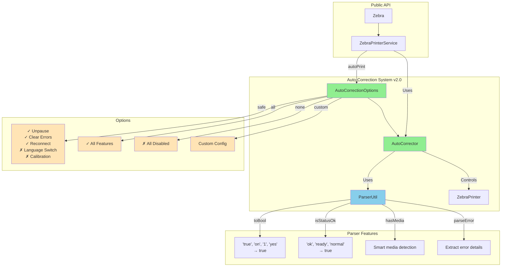

# Auto-Correction Architecture v2.0

## Overview

Version 2.0 introduces a configurable auto-correction system that can automatically resolve common printer issues without user intervention.

## Architecture Diagram



## Components

### AutoCorrectionOptions
Configuration class that controls which auto-corrections are enabled:
- `enableUnpause`: Automatically unpause paused printers
- `enableClearErrors`: Clear recoverable printer errors
- `enableReconnect`: Reconnect on connection loss
- `enableLanguageSwitch`: Switch printer language based on data format
- `enableCalibration`: Auto-calibrate when media detection issues occur

### AutoCorrector
Internal class that performs the actual corrections:
- Checks printer readiness state
- Applies enabled corrections in sequence
- Reports actions taken
- Handles errors gracefully

### ParserUtil
Robust parsing utilities that never fail:
- Converts various boolean representations ('true', 'on', '1', etc.)
- Interprets printer status messages
- Extracts error information
- Normalizes status strings

## Usage Examples

### Basic Usage with Safe Defaults
```dart
// Uses safe defaults: unpause, clear errors, reconnect
await Zebra.autoPrint(data, 
  autoCorrectionOptions: AutoCorrectionOptions.safe()
);
```

### Custom Configuration
```dart
await Zebra.autoPrint(data,
  autoCorrectionOptions: AutoCorrectionOptions(
    enableUnpause: true,
    enableClearErrors: true,
    enableReconnect: false,  // Don't reconnect
    enableLanguageSwitch: true,  // Auto-switch language
    enableCalibration: false,
    maxAttempts: 5,  // Try up to 5 times
    attemptDelayMs: 1000,  // Wait 1 second between attempts
  )
);
```

### Disable All Auto-Corrections
```dart
await Zebra.autoPrint(data, 
  autoCorrectionOptions: AutoCorrectionOptions.none()
);
```

## Auto-Correction Flow

1. **Check Printer Readiness**
   - Connection status
   - Media presence
   - Head status
   - Pause state
   - Error conditions

2. **Apply Corrections** (if enabled)
   - Unpause: Send unpause commands (SGD and ZPL)
   - Clear Errors: Send error clear command
   - Calibrate: Run media calibration
   - Language Switch: Change printer mode to match data

3. **Verify Success**
   - Re-check printer readiness
   - Report actions taken
   - Continue with printing if successful

## Parser Capabilities

The `ParserUtil` class provides safe parsing that never throws exceptions:

### Boolean Parsing
Recognizes multiple formats:
- 'true', 'TRUE', 'True' → `true`
- 'on', 'ON', 'On' → `true`
- '1', 'yes', 'y', 'enabled', 'active' → `true`
- 'false', 'off', '0', 'no', 'n', 'disabled' → `false`

### Status Interpretation
- `isStatusOk()`: Checks for 'ok', 'ready', 'normal', 'idle'
- `hasMedia()`: Smart media detection
- `isHeadClosed()`: Checks head latch status
- `parseErrorFromStatus()`: Extracts specific error messages

### Safe Conversions
- `toInt()`: Convert to integer with fallback
- `toDouble()`: Convert to double with fallback
- `safeToString()`: Never returns null
- `extractNumber()`: Extract numbers from strings like "203 dpi"

## Benefits

1. **Reduced Manual Intervention**: Common issues are automatically resolved
2. **Configurable**: Enable only the corrections you want
3. **Safe Parsing**: Never crashes on unexpected printer responses
4. **Detailed Feedback**: Know exactly what corrections were applied
5. **Backward Compatible**: Existing code continues to work 