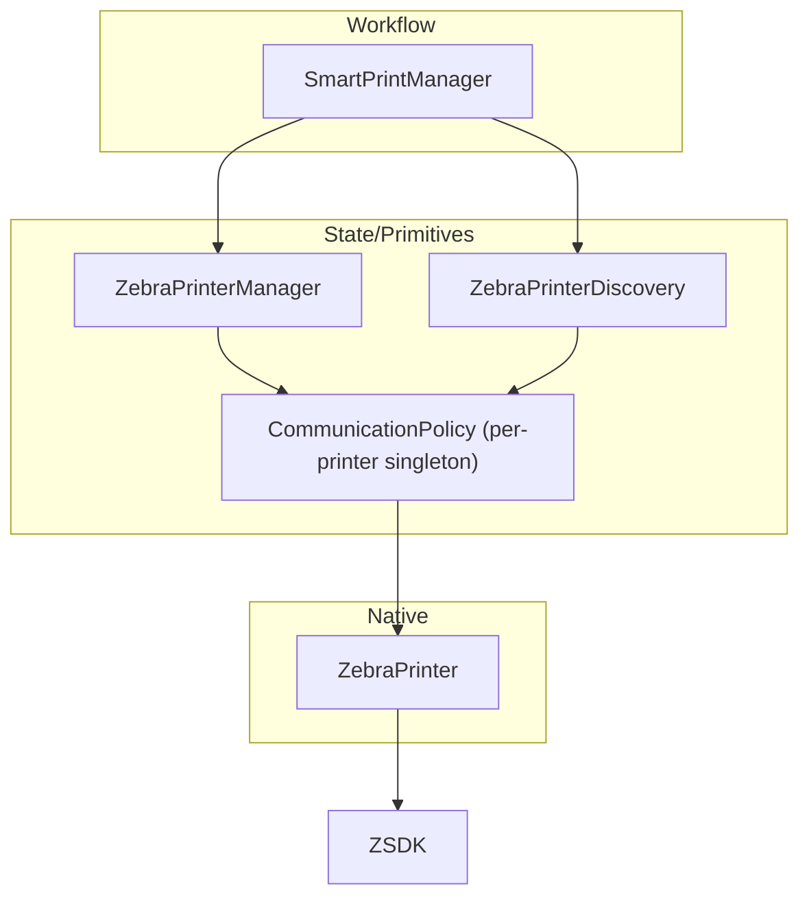

# Architecture Improvement Delivery Plan
## Multi-Step Implementation Strategy for Zebra Printer Utility

### Overview

This plan reorganizes the architecture and code quality improvements into discrete, valuable deliverables. Each step provides immediate value and can stand alone, even if subsequent steps are not completed. Steps are ordered to maximize early value delivery and minimize dependencies.

### Step 1: Simplify Public API (1 week)
**Goal**: Eliminate decision paralysis by providing one clear path for printing

**Deliverables**:
- Single `Zebra.print()` method that handles 90% of use cases
- Complete replacement of old methods
- Updated README with new simple examples
- Clean, unified API surface

**Tasks**:
1. Design simplified API surface (1 day)
2. Implement new `Zebra.print()` with smart defaults (2 days)
3. Replace old methods completely (1 day)
4. Update examples and documentation (1 day)

**Success Criteria**:
- New users can print in < 5 lines of code
- Complete API replacement implemented
- Clear documentation showing the single recommended path

**Value**: Immediate improvement in developer experience, reduced support burden

---

### Step 2: Organize Error System and Remove Unused Codes (4-5 days)
**Goal**: Make error handling manageable and meaningful through better organization

**Deliverables**:
- Enhanced error categorization and classification system
- Removed unused error codes (maintaining used ones)
- Improved error helper methods and extensions  
- Updated error documentation
- Clean error system with no unused code

**Tasks**:
1. Audit error code usage and analyze existing extensions (1 day)
   - Review current `ResultErrorClassification` extension with 6 boolean methods
   - Review `ErrorType` enum with 22 classification types
   - Map actual usage of existing helper methods
2. Consolidate redundant errors and enhance classifications (1.5 days)
3. Remove unused error codes and update mappings (1 day)
4. Enhance error classification extensions with missing helper methods (1 day)
   - Add `isPrintError`, `isDiscoveryError`, `isRecoverableError`, `isCriticalError`
   - Improve `ErrorType` mapping accuracy in `errorType` getter
5. Update documentation and examples (0.5 days)

**Success Criteria**:
- Enhanced error categorization with useful helper methods
- Zero unused error codes remaining
- Improved error classification extensions  
- Complete error system cleanup
- Clear documentation of error categories and usage

**Value**: Better organized error handling, improved developer experience, reduced maintenance burden

---

### Step 3: Print Data Preparation Refactor **(COMPLETED – v2.0.59)**
**Status**: ✅ Delivered in version **2.0.59**. Mixed-responsibility logic was extracted into three focused utilities:

* `PrintDataValidator` – validation only
* `PrintDataDetector` – format detection & analysis
* `PrintDataFormatter` – CPCL/ZPL formatting

`parseResponse()` was relocated from the now-removed `ZebraSGDCommands` to `ParserUtil`.

**Outcome**:
* Removed `ZebraSGDCommands` (no pass-through helpers remain)
* All callers updated to use the new utilities directly
* 100 % unit-test coverage for validator/detector/formatter
* Codebase fully lint-clean and tests green (348 / 348)

> The following steps already assume these utilities exist; any reference to the old formatter/detector code has been updated accordingly.

---
### Step 4: Implement Real Unit Tests for Core Components (1 week)
**Goal**: Establish foundation for confident refactoring

**Deliverables**:
- Real unit tests for `ZebraErrorBridge`
- Real unit tests for `PrintDataFormatter`
- Real unit tests for connection state management
- Test utilities and fixtures

**Tasks**:
1. Replace mock tests with real implementations (3 days)
2. Create test fixtures and utilities (1 day)
3. Achieve >80% coverage for tested components (1 day)

**Success Criteria**:
- No mock-only tests remain for covered components
- Tests actually verify behavior, not mocks
- Can refactor with confidence

**Value**: Enables safe refactoring in future steps

---

### Step 5: Fix Connection State Naming (3 days)
**Goal**: Eliminate confusion around connection status

**Deliverables**:
- Consistent `isConnected` naming throughout
- Complete naming standardization
- Updated documentation
- Clean codebase with consistent naming

**Tasks**:
1. Standardize all connection state references (1 day)
2. Replace old naming completely (1 day)
3. Update tests and documentation (1 day)

**Success Criteria**:
- One clear way to check connection status
- Complete replacement implemented
- No naming inconsistencies remaining

**Value**: Reduced confusion, cleaner API

---

### Step 6: Create Simplified Event System (4 days)
**Goal**: Replace complex event system with simple, understandable events

**Deliverables**:
- Single `PrintEvent` type with clear states
- Simple callback option alongside streams
- Complete event system replacement
- Clean unified event architecture

**Tasks**:
1. Design unified event system (1 day)
2. Implement new event system (1 day)
3. Replace old event types completely (1 day)
4. Update examples and documentation (1 day)

**Success Criteria**:
- One event type to understand
- Both callback and stream options
- Old code continues working

**Value**: Dramatically simplified event handling

---

### Step 7: Split ZebraPrintingPopup Responsibilities (1 week)  
**Goal**: Make `ZebraPrintingPopup` maintainable by extracting responsibilities from current 1,712-line widget

**Current State**: `ZebraPrintingPopup` contains:
- Animation management (3 `AnimationController`s: fade, slide, scale)
- Discovery state management (`_printers`, `_isDiscovering`, anti-blink logic)
- Print state management (`PrintState`, error handling, progress tracking)
- Diagnostic panel management (`DiagnosticLogManager`, `PrintingAnalyticsService`)
- Stream subscription management (discovery and print events)

**Deliverables**:
- `PrintStateManager` class extracting `PrintState`, error handling, and progress logic
- `PrintAnimationController` class managing all 3 animation controllers and transitions
- `DiscoveryCoordinator` widget handling discovery state, anti-blink, and printer list
- `DiagnosticsPanelManager` widget managing diagnostics and analytics
- Thin main `ZebraPrintingPopup` widget (~200-300 lines) orchestrating components
- Widget tests for each extracted component

**Tasks**:
1. Extract `PrintStateManager` and `PrintAnimationController` classes (2 days)
2. Create `DiscoveryCoordinator` and `DiagnosticsPanelManager` widgets (1 day)  
3. Refactor main widget to use extracted components (1 day)
4. Write widget tests for each component (1 day)

**Success Criteria**:
- Each component < 200 lines (down from 1,712 lines total) - this 200 is not a HARD GOAL
- Independent testing possible for each component
- No behavior changes in animation timing, discovery flow, or state management

*Note: During refactoring, additional responsibilities may be discovered within the current widget methods, potentially requiring more component extractions. Goal: achieve single responsibility per component.*

**Value**: Maintainable UI code, easier feature additions, improved testability

---

### Step 8: Remove Command Pattern Overhead (4 days)
**Goal**: Simplify codebase by removing unnecessary command pattern abstraction

**Current State**: 25+ command classes with `BaseCommand<T>` and `PrinterCommand<T>` hierarchy:
- `GetSettingCommand`, `SendCommandCommand`, `CheckConnectionCommand`
- `GetMediaStatusCommand`, `GetHeadStatusCommand`, `GetPauseStatusCommand`
- `SendClearBufferCommand`, `SendZplClearBufferCommand`, `SendCpclClearBufferCommand`
- `SendSetZplModeCommand`, `SendSetCpclModeCommand`, `SendCalibrationCommand`
- Plus 15+ other specialized commands with `CommandFactory` for creation

**Deliverables**:
- Simple methods replacing 25+ command classes (e.g., `printer.getSetting(name)` instead of `CommandFactory.createGetSettingCommand().execute()`)
- Removed `BaseCommand<T>`, `PrinterCommand<T>`, and `CommandFactory` infrastructure  
- Maintained functionality with direct method calls on `ZebraPrinter`
- Performance benchmarks comparing old vs new approach

**Tasks**:
1. Convert command classes to simple methods on `ZebraPrinter` (2 days)
2. Update all callers in managers and communication policy (1 day)
3. Remove command infrastructure classes and factory (0.5 days)
4. Performance testing to ensure no degradation (0.5 days)

**Success Criteria**:
- 500+ lines of command pattern code removed
- Same functionality maintained (all current operations still work)
- No performance degradation in operation execution

*Note: During conversion, some commands may reveal they're thin wrappers around single method calls, potentially allowing for even more simplification. Goal: remove all unnecessary indirection.*

**Value**: Simpler codebase, faster development, reduced cognitive overhead

---

### Step 9: Clean Architecture Dependencies (1 week)
**Goal**: Enforce the updated 3-layer architecture and ensure clear, one-directional dependencies

```
Workflow / Orchestration  →  State / Primitives  →  Native Wrapper
SmartPrintManager         →  ZebraPrinterManager & ZebraPrinterDiscovery  →  ZebraPrinter
```

#### Current Violations
1. **Manager ↔ Discovery Coupling**  
   • `ZebraPrinterManager` lazily instantiates `ZebraPrinterDiscovery` (state layer ↔ state layer) — creates hidden coupling and makes discovery logic impossible to reuse.  
2. **CommunicationPolicy Multiplication**  
   • Each manager creates its own `CommunicationPolicy`; some components bypass it entirely.  
3. **Upward Imports**  
   • Lower layers (`ZebraPrinterDiscovery`) import workflow classes in a few utility methods.  
4. **Export Leakage**  
   • `zebrautil.dart` exports internal classes (`ZebraPrinterManager`, `ZebraPrinterDiscovery`, `CommunicationPolicy`) exposing implementation details to library users.

#### Should-Be Architecture (after this step)


#### Deliverables
- `ZebraPrinterManager` **no longer contains** `discovery` getter; it focuses on connection & primitive ops only.  
- `ZebraPrinterDiscovery` remains state layer but **has zero imports** from workflow or manager classes.  
- `SmartPrintManager` constructed with **both** manager & discovery and orchestrates them.  
- **Singleton‐per-printer `CommunicationPolicy`** created in one place and injected into managers; no ad-hoc instantiation elsewhere.  
- `zebrautil.dart` exports trimmed to **public API only** (`zebra.dart` + public models).  
- **Architecture tests** (e.g. `build_runner` + dep-graph) fail CI when upward imports detected.

##### Layer Responsibilities Recap
| Layer | Responsibility | Key Classes |
|-------|----------------|-------------|
| Workflow / Orchestration | High-level workflows, retries, progress | `SmartPrintManager` |
| State / Primitives | Connection state, discovery, readiness, policy | `ZebraPrinterManager`, `ZebraPrinterDiscovery`, `CommunicationPolicy` |
| Native Wrapper | Thin typed bridge to Link-OS SDK | `ZebraPrinter`, native binders |


#### Tasks
1. **Refactor Manager ↔ Discovery** (2 days)  
   • Delete `_discovery` field & getter from `ZebraPrinterManager`.  
   • Update manager initialization & streams (connection/printer list) to rely on injected discovery if needed.  
2. **Inject Discovery into SmartPrintManager** (0.5 day)  
   • `SmartPrintManager({required ZebraPrinterManager manager, required ZebraPrinterDiscovery discovery})`  
   • Update logic to call discovery directly for printer selection workflows.  
3. **Centralise CommunicationPolicy** (1 day)  
   • Create factory/helper to obtain per-printer singleton.  
   • Inject into all managers; remove duplicate instantiations.  
4. **Clean Exports** (0.5 day)  
   • Limit `zebrautil.dart` exports to `zebra.dart` and public models.  
5. **Add Architecture Tests** (1 day)  
   • Use `import_graph` or custom build script to assert no upward imports & correct exports.  
6. **Documentation & Rule Update** (0.5 day)  
   • Update `zebra-architecture.mdc` (already added) & README diagrams.

#### Success Criteria
- **Zero upward imports** detected by architecture tests.  
- `SmartPrintManager` compiles with new constructor and runs existing example flows.  
- `ZebraPrinterManager` & `ZebraPrinterDiscovery` share *no* imports.  
- Only one `CommunicationPolicy` instance per printer.  
- Public API surface unchanged for package consumers.

*Note: While refactoring, hidden coupling (e.g., shared stream controllers) may appear; address them in-flight but keep layers pure. Goal: enforce clean, maintainable architecture.*

---

### Step 10: Consolidate Connection Assurance in CommunicationPolicy (2 days)
**Goal**: Remove all duplicated connection-check / retry loops and delegate every connection concern to `CommunicationPolicy.execute()` using its existing `skipConnection*` flags.

#### Current Duplication
- Custom loops in `ZebraPrinterManager.connect()` and `SmartPrintManager._connectToPrinter()`
- Local cache checks followed by `isPrinterConnected(forceCheck)` sprinkled across managers and UI
- Re-implementation of retry/back-off logic in three places

#### Deliverables
- **No new helpers or classes introduced** – KISS principle
- `CommunicationPolicy.execute()` remains the *single* entry-point for connection assurance, retry, and timeout handling
- `ZebraPrinter` keeps its 30-second connection cache & native `connection_lost` updates (unchanged)
- `ZebraPrinterManager` and `SmartPrintManager` call `policy.execute()` directly; their local while-loops are deleted
- All call-sites that need an explicit connection step now call `printer.ensureConnected(forceRefresh:true)` – which:
   1. Returns cached `true` immediately when valid (fast path)
   2. Otherwise performs a hardware round-trip via `CommunicationPolicy.execute()` (slow path with retry)
   3. Updates the cache on success/failure
   No other code should call `isPrinterConnected(forceCheck:true)` directly.
- Documentation & cursor rules updated to state: "If you need connection assurance, use `CommunicationPolicy.execute()` without `skipConnectionCheck`".

#### Tasks
1. **Add cache-aware helper** (0.25 day)  
   • Implement `ZebraPrinter.ensureConnected({bool forceRefresh = false})` as described above.
2. **Refactor Manager.connect** (0.5 day)  
   • Replace custom retry loop with `return printer.ensureConnected(forceRefresh:true);`
3. **Refactor SmartPrintManager._connectToPrinter** (0.5 day)  
   • Delete bespoke while-loop; use progress events around `printer.ensureConnected(forceRefresh:true)`.
4. **Remove Unused Flags / Helpers** (0.25 day)  
   • Delete `_executeWithRetry` connection-specific branch; rely on policy defaults.
5. **Update DRY Section in Quality Report** (0.25 day)  
   • Reflect cache-first `ensureConnected` helper.
6. **Unit Tests** (0.5 day)  
   • Cases: fresh cache returns immediately; forceRefresh bypasses cache; connection error triggers retry ≤ maxAttempts.

#### Success Criteria
- Only one implementation of connection assurance exists (inside policy)
- Manager & SmartPrintManager trimmed by >80 LOC each
- All print workflows still succeed; CI tests green

*Note: Future code should never call `isPrinterConnected(forceCheck:true)` directly; always use `printer.ensureConnected(...)` which in turn routes through `CommunicationPolicy`.*

**Value**: Strict DRY, simpler surface area, easier reasoning & testing.

---

### Step 11: Dead Code Removal (3 days)
**Goal**: Clean, focused codebase by removing unused code discovered in earlier analysis

**Current Dead Code Identified**:
- Unused error codes from the 70+ `ErrorCodes` (many never referenced in codebase)
- `SendGenericClearErrorsCommand` and other unused command classes
- Legacy callback patterns in test files 
- Unused utility methods in various helper classes
- Obsolete commented-out code blocks

**Deliverables**:
- Removed unused error codes from `ErrorCodes` class (maintaining used ones)
- Deleted unused command classes and their factory methods
- Complete removal of commented-out legacy code
- Cleaned unused dependencies from `pubspec.yaml`
- Size reduction report showing bundle impact

**Tasks**:
1. Remove unused error codes identified in Step 2 audit (0.5 days)
2. Delete unused command classes (0.5 days)  
3. Remove legacy patterns and commented code completely (1 day)
4. Clean unused dependencies and generate size report (1 day)

**Success Criteria**:
- No unused code remains (verified by static analysis)
- Reduced bundle size (measured and reported)
- All existing tests still pass (no functionality lost)

*Note: During removal, additional unused code may be discovered through static analysis tools, potentially requiring broader cleanup. Goal: achieve zero unused code while maintaining all current functionality.*

**Value**: Cleaner codebase, smaller package size, reduced cognitive load

---

### Step 12: Complete Testing Suite (1 week)
**Goal**: Comprehensive test coverage for confidence

**Deliverables**:
- Integration tests for workflows
- Widget tests for UI
- CI/CD pipeline updates
- Coverage reports

**Tasks**:
1. Write integration tests (3 days)
2. Complete widget tests (1 day)
3. Set up CI/CD gates (1 day)

**Success Criteria**:
- >80% overall coverage
- All critical paths tested
- Automated quality gates

**Value**: Confidence in changes, catch regressions

---

### Step 13: Extract Remaining Shared Utilities (3 days)
**Goal**: Complete DRY refactoring

**Deliverables**:
- Error handling framework
- Retry utilities
- Common patterns library
- Documentation

**Tasks**:
1. Create error handling utilities (1 day)
2. Extract retry logic (1 day)
3. Document patterns (1 day)

**Success Criteria**:
- No duplicated patterns remain
- Clear when to use utilities
- Well documented

**Value**: Maintainable codebase

---

### Step 14: Final Documentation and Polish (3 days)
**Goal**: Professional, approachable library

**Deliverables**:
- Complete API documentation
- Architecture diagrams
- Recipe-based guides
- Implementation timeline

**Tasks**:
1. Update all documentation (1 day)
2. Create architecture diagrams (1 day)
3. Write cookbook recipes (1 day)

**Success Criteria**:
- Every public API documented
- Clear architecture visualization
- Easy onboarding path

**Value**: Reduced support burden, happy developers

---

### Step 15: Example App Alignment (2 days)
**Goal**: Ensure the Flutter example app reflects the new architecture and APIs

**Current State**: Example screens (`example/lib/screens/*`) directly use managers and discovery in ways that will change after Steps 1-14.

**Deliverables**:
- Updated `discovery_screen.dart`, `smart_print_screen.dart`, and other example screens to use the new simplified API (`Zebra.print()`), event system, and connection utilities
- Removed any direct command pattern usage in example
- Updated README snippets in `example/README.md`

**Tasks**:
1. Update discovery screen to consume `Zebra.discovery.devices` stream (0.5 day)
2. Update smart print screen to new `SmartPrintManager` API (0.5 day)
3. Remove legacy direct command examples (0.5 day)
4. Update example README and screenshots (0.5 day)

**Success Criteria**:
- Example app runs without deprecation warnings
- Prints successfully using new architecture
- README reflects current API

*Note: Additional tweaks may be required once previous steps land. Goal: keep example app in sync with library changes.*

**Value**: Developers learn the new API faster; avoids outdated code samples.

---

### Step 16: Mobile ZebraPrinter UI Refactor (4 days)
**Goal**: Align in-app ZebraPrinter widgets (`/mobile/src/lib/Widgets/ZebraPrinter`) with refactored architecture

**Current State**: Widgets (`ZebraPrintingPopup`, `PrintingPanel`, etc.) rely on old SmartPrintManager event shapes and large monolithic code (>50 KB per file).

**Deliverables**:
- Widgets updated to listen to new event types and streams
- Removed obsolete state logic replaced by `PrintStateManager`
- Extracted reusable sub-widgets (max 300 lines per file)
- Added unit/widget tests for critical UI flows

**Tasks**:
1. Update `ZebraPrintingPopup` to use extracted components and new event system (2 days)
2. Refactor `PrintingPanel`, `PrintSelectionPanel`, etc., to decouple from old manager internals (1 day)
3. Write widget tests covering success, error, cancel flows (1 day)

**Success Criteria**:
- UI compiles and functions with new architecture
- Component files ≤300 lines where feasible
- Tests cover >70 % of widget logic

*Note: Refactor may reveal hidden dependencies; iterate as discovered. Goal: maintainable, testable UI code aligned with new backend.*

**Value**: Cleaner UI layer, easier maintenance, consistent user experience.

---

## Implementation Notes

### Prioritization Rationale
1. **Steps 1-2**: Immediate developer experience improvements
2. **Steps 3-5**: Quick wins that enable future work
3. **Steps 6-9**: Core architectural improvements
4. **Steps 10-13**: Cleanup and quality improvements
5. **Step 14**: Polish and professionalism

### Risk Mitigation
- Each step delivers complete functionality
- Full replacement approach ensures clean architecture
- Tests added before major refactoring
- Performance benchmarks prevent degradation

### Success Metrics
- Developer satisfaction surveys
- Support ticket reduction
- Time to first successful print
- Code coverage percentage
- Bundle size reduction
- Build time improvements

### Alternative Paths
Some steps can be reordered based on team priorities:
- Testing (Step 4) could come earlier for more safety
- UI improvements (Step 7) could be delayed if not critical
- Dead code removal (Step 11) could happen anytime

Each step is designed to deliver value independently while building toward the larger goal of a maintainable, developer-friendly library.
